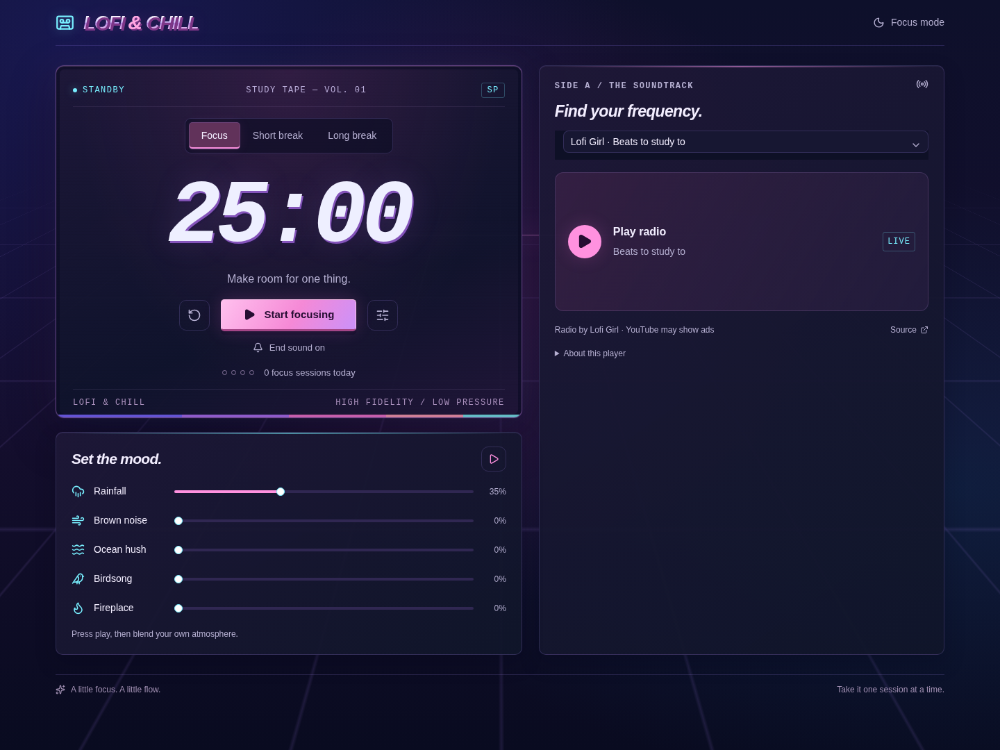

# lofi & chill

A synthwave study desk with a Pomodoro timer, YouTube lofi radio, and ambient sounds.



## Features

- Adjustable focus sessions and breaks, with a gentle end sound. Switching timer tabs pauses and preserves progress; return and press Resume to continue.
- Four YouTube radio stations that play directly on the page.
- Real rain, birdsong, and fireplace loops, plus brown noise and ocean sounds, with individual volume controls.
- Focus mode and a daily session count.
- Preferences saved in your browser.

Radio requires an internet connection. Press play to start audio; YouTube broadcasts may show ads or occasionally be unavailable.

## Run locally

Requires Node.js 24 or later.

```sh
npm ci
npm run dev
```

Open the local URL printed by the server, usually http://localhost:5173.

```sh
npm run build
npm run preview
```

The production build is saved in `dist/`. Preview serves that build locally.

## Technologies

Vite, React, TypeScript, Tailwind CSS, and shadcn/Base UI. Runs entirely in the browser; no backend or API keys required.

## Checks

```sh
npm test
npm run typecheck
npm run lint
npm run format -- --check
```
